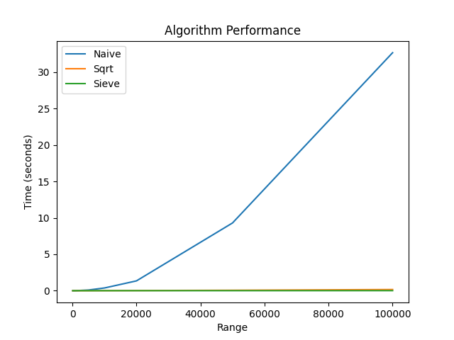
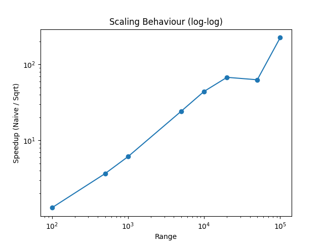
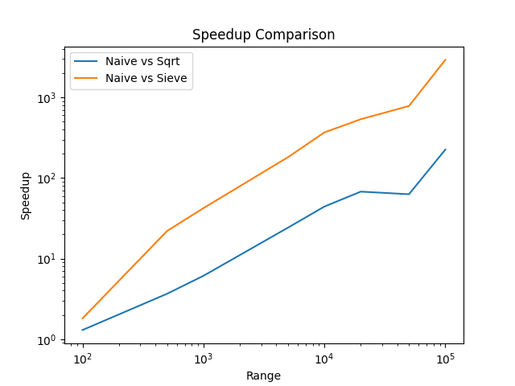
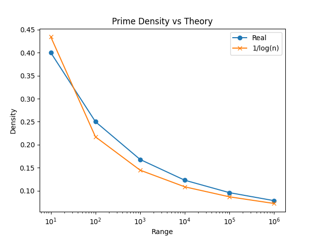

# 🔷 Prime Analytics v1

## 🧠 Idea central
> “No se trata de calcular primos, sino de entender cómo se comportan.”

---

## ⚙️ Qué hace este proyecto

Este proyecto analiza números primos desde tres perspectivas:

- **Algorítmica** → comparación de métodos de cálculo  
- **Performance** → benchmarking y análisis de escalabilidad  
- **Matemática** → densidad de primos y modelo teórico  

El objetivo no es solo obtener resultados, sino comprender **cómo crecen, escalan y se comportan** los números primos.

---

## 📊 1. Algorithm Performance

### 💡 Insight

A medida que crece el rango analizado, las diferencias entre algoritmos dejan de ser pequeñas mejoras y pasan a ser cambios estructurales.

El método ingenuo escala rápidamente y se vuelve impracticable, alcanzando tiempos elevados incluso para valores relativamente moderados.

En contraste, la optimización por raíz cuadrada reduce significativamente el tiempo, mientras que la criba de Eratóstenes mantiene un comportamiento casi constante en comparación.

👉 **Conclusión:**  
La diferencia entre algoritmos no es incremental, sino estructural.

---

## 📊 2. Scaling Behaviour (log-log)

### 💡 Insight

En escala log-log se revela el comportamiento real de la escalabilidad.

El speedup crece de forma sostenida a medida que aumenta el tamaño del problema, mostrando que los algoritmos eficientes no solo son más rápidos, sino que **su ventaja se amplifica con n**.

La relación aproximadamente lineal sugiere un comportamiento de tipo potencia, evidenciando que la diferencia entre enfoques es profunda y no superficial.

👉 **Conclusión:**  
Los algoritmos no muestran su verdadera diferencia en problemas pequeños, sino en grandes escalas.

---

## 📊 3. Speedup Comparison

### 💡 Insight

El análisis de speedup muestra cuántas veces un algoritmo es más rápido que otro.

La comparación entre el método ingenuo y la optimización por raíz cuadrada revela una mejora significativa.

Sin embargo, la criba de Eratóstenes produce un salto cualitativo: su ventaja crece mucho más rápido con el tamaño del rango.

👉 **Conclusión clave:**  
A gran escala, la diferencia entre algoritmos deja de ser una cuestión de rendimiento y pasa a ser una cuestión de viabilidad.

---

## 📊 4. Prime Density vs Theory

### 💡 Insight

La densidad de números primos disminuye a medida que crece el rango, pero lo hace de forma predecible.

La aproximación teórica \(1 / \log(n)\) sigue de cerca la densidad real, mejorando su precisión a medida que crece n.

Esto refleja una propiedad fundamental de los números primos:

- son impredecibles localmente  
- pero siguen patrones globales consistentes  

👉 **Conclusión:**  
La matemática emerge del comportamiento colectivo de los números.

---

## 🔥 Conclusiones generales

- Los algoritmos no escalan de la misma manera  
- El enfoque tiene mayor impacto que la optimización  
- La eficiencia se vuelve crítica en problemas grandes  
- Los números primos muestran orden dentro del aparente caos  

---

## 🚀 Próximos pasos

- error absoluto y relativo  
- regresión y modelado  
- análisis con ventanas móviles  
- primos gemelos  
- exportación de datos  
- visualización en Power BI  

---

## 🧠 Reflexión final

Este proyecto muestra que:

> **el verdadero valor no está en calcular resultados, sino en entender los procesos que los generan.**
